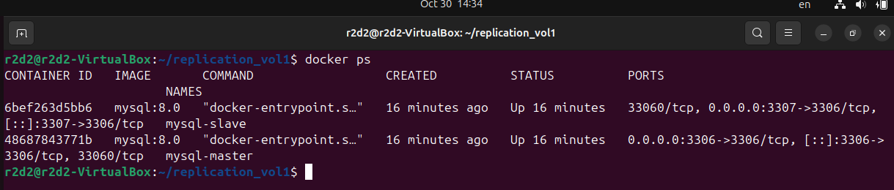
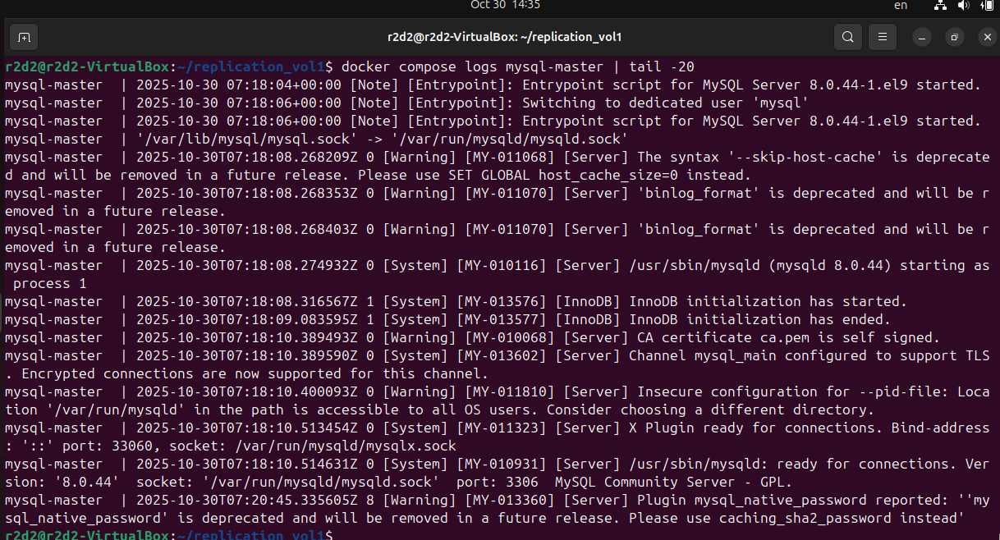
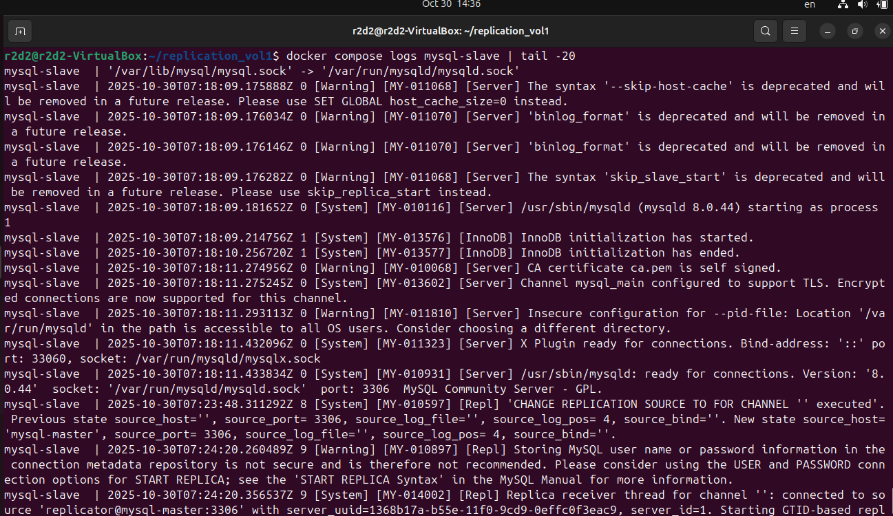
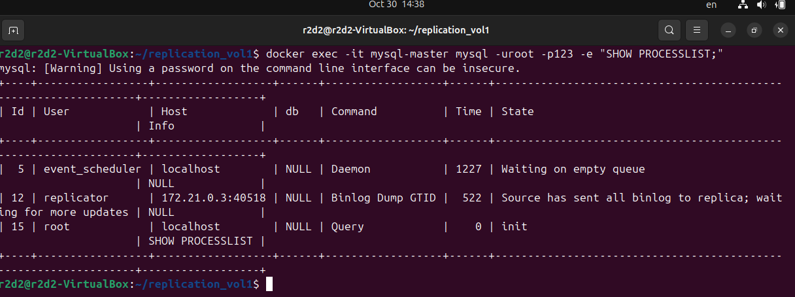
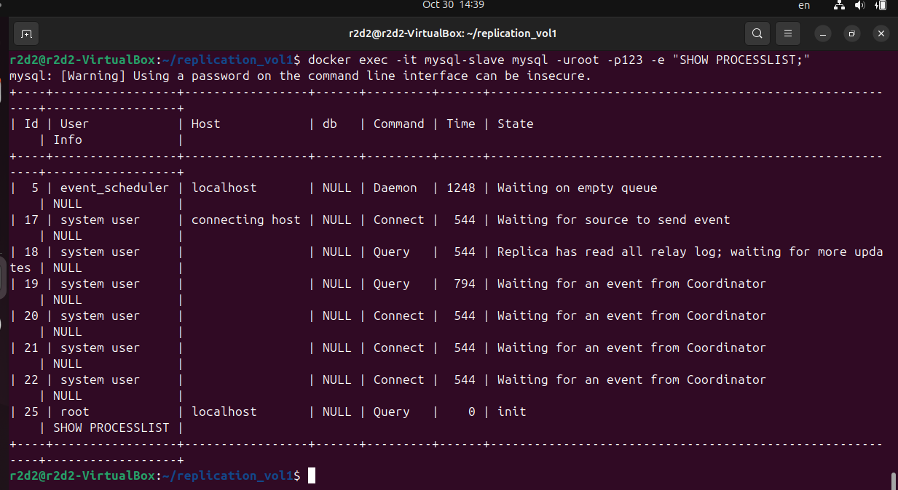
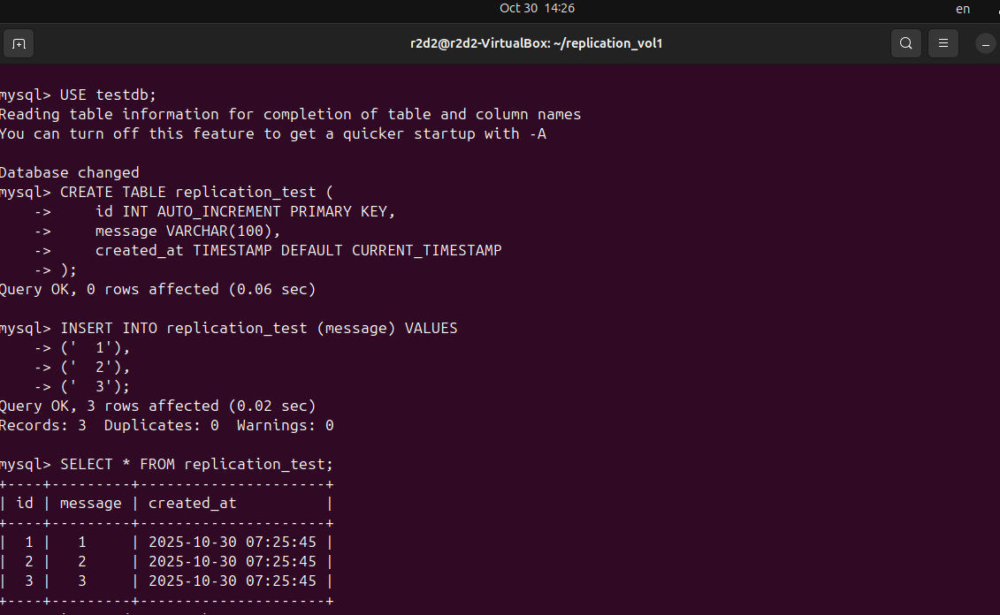
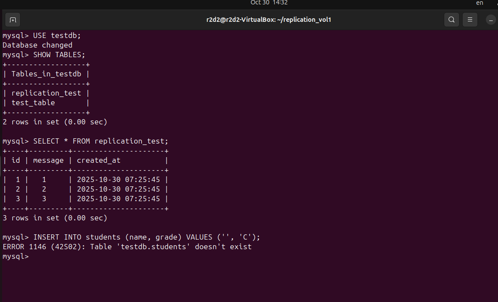

# Домашнее задание к занятию "Репликация и масштабирование. Часть 1" - Котов Г.И.

### Задание 1
На лекции рассматривались режимы репликации master-slave, master-master, опишите их различия.

Ответить в свободной форме.

### Решение 1: 

Master-Slave:

- Один главный сервер (master) на запись и чтение, один или несколько подчиненных (slave) только на чтение.

- Данные реплицируются односторонне: master → slave.

- Подходит для масштабирования чтения, резервного копирования, аналитики.

- Простая структура, меньше рисков конфликтов.

Master-Master:

- Оба сервера равноправны: читают и пишут.

- Репликация двусторонняя: изменения с одного master передаются на другой.

- Подходит для высокой доступности и географического распределения.

- Сложнее в настройке, возможны конфликты данных при одновременной записи в одни строки.

Основные различия:

- Направление записи: master-slave — только в master, master-master — в любой узел.

- Сложность: master-master сложнее из-за риска конфликтов репликации.

- Использование: master-slave для чтения, master-master для записи в разных локациях.

### Задание 2

Выполните конфигурацию master-slave репликации, примером можно пользоваться из лекции.

Приложите скриншоты конфигурации, выполнения работы: состояния и режимы работы серверов.

### Решение 2: 

### Задание 3

Выполните конфигурацию master-master репликации. Произведите проверку.

Приложите скриншоты конфигурации, выполнения работы: состояния и режимы работы серверов.

### Решение 3: 

